# Y-CarParts

Y-CarParts is a full-stack e-commerce web application built with Django that allows users to browse, search and purchase car parts online. The application provides a modern shopping experience where customers can create accounts, browse products by category, add items to their shopping cart, submit product reviews and complete secure payments using Stripe's test payment system.

The project was developed using HTML, CSS, JavaScript, Bootstrap, Python, Django and SQLite while following responsive web design principles and full-stack development practices.

# Purpose and Value

Y-CarParts was created to provide customers with an easy-to-use online platform for purchasing vehicle parts and accessories.

The platform provides value to users by:

* Browsing a wide range of vehicle parts organised into categories.
* Searching products quickly using the built-in search feature.
* Viewing detailed information for each product.
* Adding products to a shopping cart before checkout.
* Completing secure online payments using Stripe.
* Creating an account to manage their shopping experience.
* Leaving reviews and ratings for products.
* Accessing the website from desktop, tablet and mobile devices through a responsive interface.

# Live Website

**Deployed Application**

## 🚀 Live Demo
https://y-carparts-97a02db8b97c.herokuapp.com/

**GitHub Repository**

https://github.com/Y40Y50/Y-CarParts

# User Stories

## As a Customer

* I want to create an account so that I can securely access my shopping profile.
* I want to log in and out of my account so that my information remains secure.
* I want to browse products by category so that I can quickly find the parts I need.
* I want to search for products by name so that I can locate items easily.
* I want to view detailed product information before purchasing.
* I want to add products to my shopping cart.
* I want to increase or decrease product quantities in my cart.
* I want to complete my purchase securely using Stripe.
* I want to leave reviews for products so I can share my experience with other customers.

## As the Site Owner

* I want to manage products through the Django Admin panel.
* I want to organise products into categories.
* I want to manage customer orders.
* I want to provide a secure authentication system.
* I want the website to be fully responsive across desktop, tablet and mobile devices.

# Features

## User Authentication

Users can:

* Register a new account.
* Log in securely.
* Log out securely.
* View their personal profile.
* Access personalised features after authentication.

## Product Catalogue

Customers can:

* Browse all available products.
* View detailed product information.
* View product images.
* See stock availability.
* View prices.

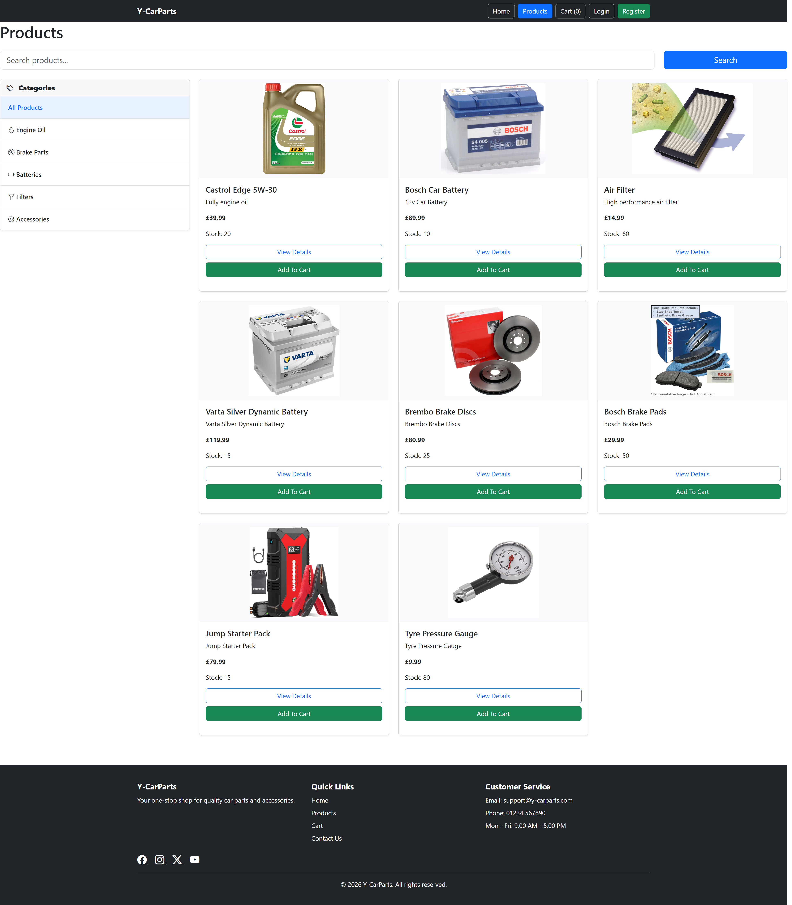

## Category Filtering

Products can be filtered by category including:

* Engine Oil
* Brake Parts
* Batteries
* Filters
* Accessories

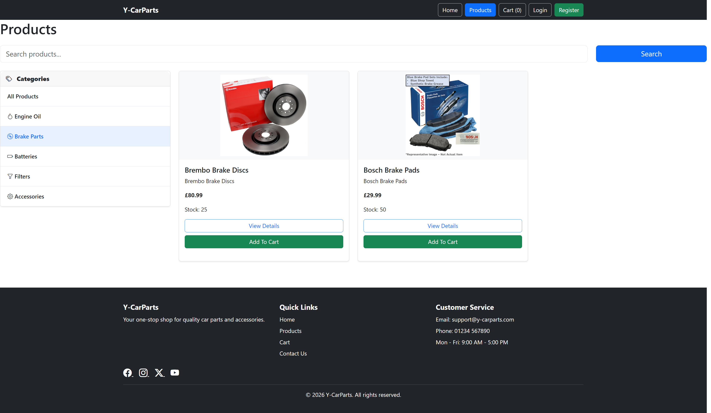

## Product Search

Users can:

* Search products by name.
* Use the JavaScript-enhanced live search functionality.
* Quickly locate matching products.

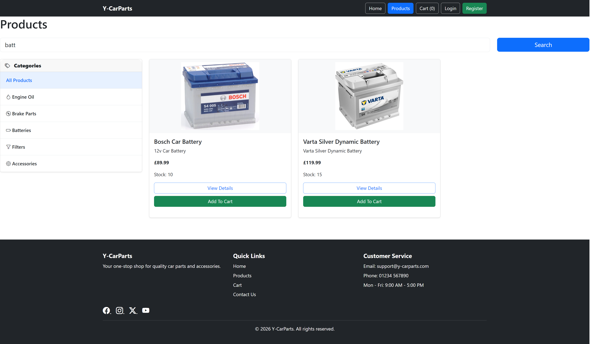


###  E-commerce
- Product listing page
- Product detail page
- Shopping cart system
- Add / remove / update quantity
- Checkout system
- Stripe payment integration

###  User System
- User registration
- Login / Logout
- User profiles

###  Media & Images
- Product images stored in Cloudinary
- Fast image delivery via CDN

### Admin Panel
- Add/edit/delete products
- Manage categories
- Manage orders
- Upload images via admin


## Shopping Cart

Customers can:

* Add products to their cart.
* Increase product quantity.
* Decrease product quantity.
* Remove products from the cart.
* View cart totals before checkout.

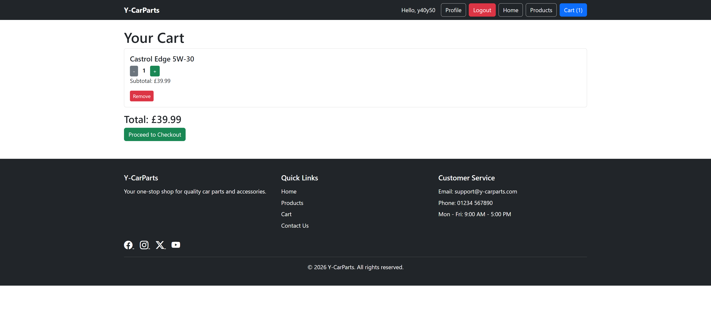

## Checkout

Customers can:

* Enter delivery information.
* Review their order.
* Proceed to secure payment using Stripe Checkout.

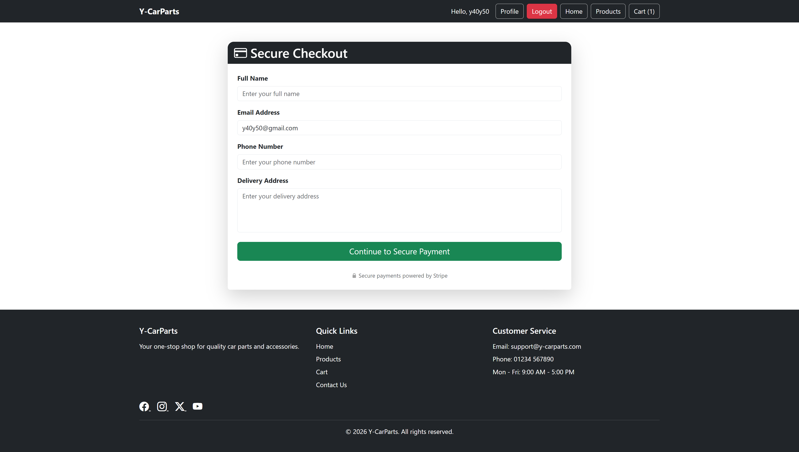

## Stripe Payments

The project integrates Stripe Test Mode to simulate secure online payments.

Customers are redirected to Stripe's hosted checkout page where payments can be completed using Stripe's test card details.

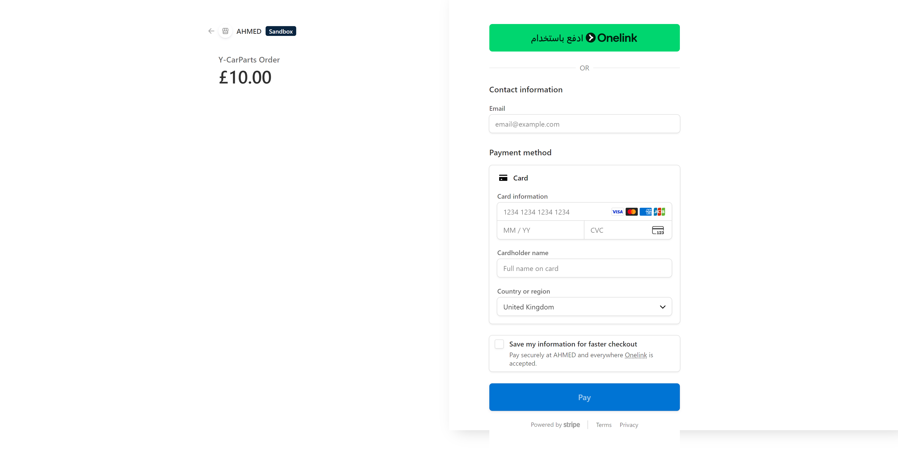

## Product Reviews

Authenticated users can:

* Submit reviews.
* Leave comments about products.
* Help future customers make purchasing decisions.

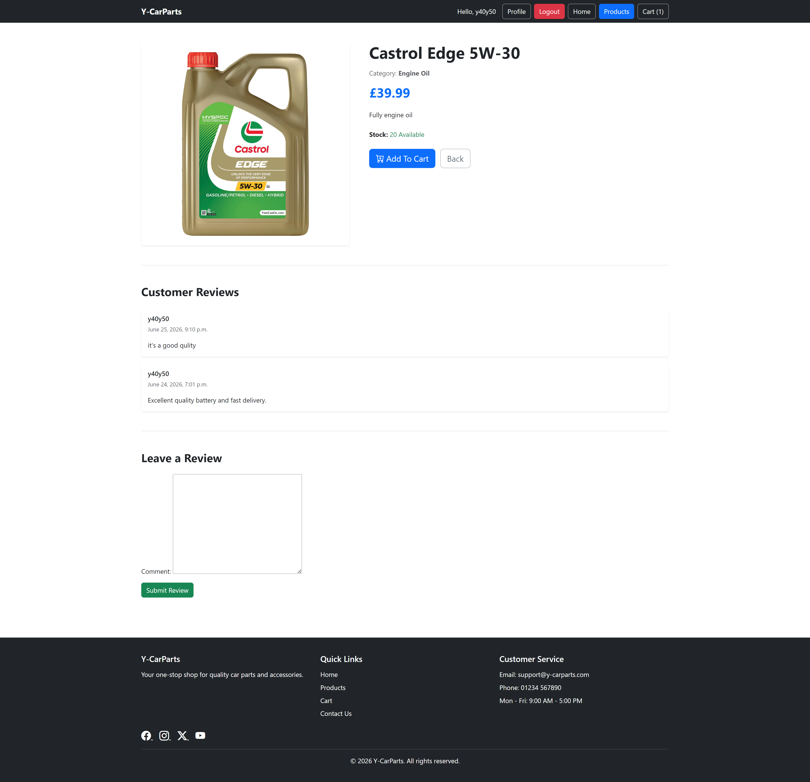

## Home Page

The homepage includes:

* Navigation menu.
* Featured products.
* Product catalogue access.
* Shopping cart shortcut.
* Responsive layout.
* Footer with social media links.


## Responsive Design

The website has been designed to support:

* Desktop devices.
* Tablet devices.
* Mobile devices.

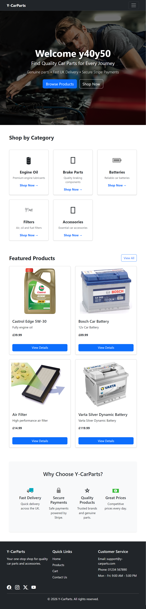

## Navigation

The responsive navigation bar provides access to:

* Home
* Products
* Cart
* Checkout
* Login
* Register
* Profile
* Logout


# Database Schema

The Y-CarParts application uses a relational database consisting of five main entities:

* User
* Category
* Product
* Order
* Review

## Entity Relationship Diagram (ERD)

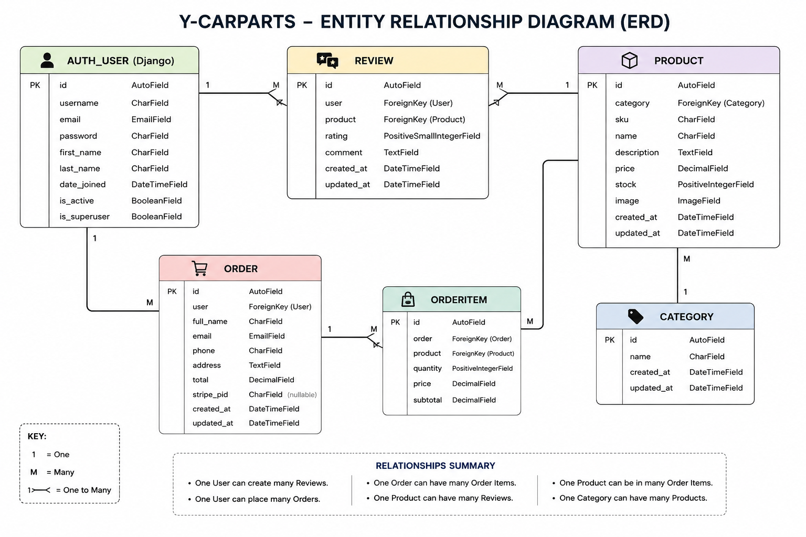


### Entity Relationships

* One User can create many Reviews.
* One Category can contain many Products.
* One Product belongs to one Category.
* One User can place many Orders.
* One Product can have many Reviews.

---

## User

The User model is provided by Django's built-in authentication system and stores user account information.

---

## Category

| Field | Type        |
| ----- | ----------- |
| id    | Primary Key |
| name  | CharField   |

---

## Product

| Field       | Type                   |
| ----------- | ---------------------- |
| id          | Primary Key            |
| category    | Foreign Key (Category) |
| sku         | CharField              |
| name        | CharField              |
| description | TextField              |
| price       | DecimalField           |
| stock       | PositiveIntegerField   |
| image       | ImageField             |

---

## Order

| Field      | Type          |
| ---------- | ------------- |
| id         | Primary Key   |
| full_name  | CharField     |
| email      | EmailField    |
| phone      | CharField     |
| address    | TextField     |
| total      | DecimalField  |
| created_at | DateTimeField |

---

## Review

| Field      | Type                  |
| ---------- | --------------------- |
| id         | Primary Key           |
| product    | Foreign Key (Product) |
| user       | Foreign Key (User)    |
| rating     | IntegerField          |
| comment    | TextField             |
| created_at | DateTimeField         |

---

## Entity Relationship Diagram

```text
User (1)
│
├── Review (Many)
└── Order (Many)

Category (1)
│
└── Product (Many)

Product (1)
│
└── Review (Many)
```

Each product belongs to a single category, while each category can contain multiple products.

Users can submit multiple product reviews and place multiple orders.

This relational structure ensures the application remains organised while maintaining data integrity between products, categories, reviews and customer orders.

---

# Technologies Used

## Programming Languages

* Python
* HTML5
* CSS3
* JavaScript

---

## Frameworks

* Django
* Bootstrap 5

---

## Database

* SQLite (Development Database)

---

## Payment Gateway

* Stripe (Test Mode)

---

## Tools and Software

* Visual Studio Code
* Git
* GitHub
* Heroku
* Google Chrome Developer Tools

---

## Libraries

* Django Authentication System
* Bootstrap Icons
* Stripe Python SDK

---

## 🛠️ Tech Stack

- Python (Django 6)
- PostgreSQL (Neon)
- Cloudinary (Image Hosting)
- Stripe (Payments)
- Bootstrap 5
- WhiteNoise (Static Files)
- Heroku (Deployment)

# Installation

## 1. Clone the repository

```bash
git clone https://github.com/Y40Y50/Y-CarParts.git
```

## 2. Navigate to the project folder

```bash
cd Y-CarParts
```

## 3. Create a virtual environment

```bash
python -m venv myenv
```

## 4. Activate the virtual environment

Windows

```bash
myenv\Scripts\activate
```

Mac/Linux

```bash
source myenv/bin/activate
```

## 5. Install project requirements

```bash
pip install -r requirements.txt
```

## 6. Run migrations

```bash
python manage.py migrate
```

## 7. Start the development server

```bash
python manage.py runserver
```

---

# Deployment

## Heroku Deployment

The application was deployed using Heroku.

### Deployment Steps

1. Create a Heroku application.
2. Connect the GitHub repository.
3. Configure Config Vars.
4. Add SECRET_KEY.
5. Add Stripe Secret Key.
6. Add Stripe Publishable Key.
7. Set DEBUG=False.
8. Deploy the main branch.
9. Run database migrations.
10. Open the deployed application.

---

# Deployment Testing

The deployed Heroku application was tested against the local development version to ensure that all functionality worked correctly after deployment.

| Feature           | Local | Live | Result |
| ----------------- | ----- | ---- | ------ |
| Homepage          | Pass  | Pass | Pass   |
| User Registration | Pass  | Pass | Pass   |
| Login             | Pass  | Pass | Pass   |
| Product Search    | Pass  | Pass | Pass   |
| Category Filter   | Pass  | Pass | Pass   |
| Shopping Cart     | Pass  | Pass | Pass   |
| Checkout          | Pass  | Pass | Pass   |
| Stripe Payment    | Pass  | Pass | Pass   |
| Product Reviews   | Pass  | Pass | Pass   |
| Responsive Design | Pass  | Pass | Pass   |


## Deployment (Heroku + Fixes)

During deployment, several issues were resolved:

### Problems faced:
- Static files returning 404 on live server
- WhiteNoise misconfiguration
- Cloudinary storage package conflict
- Missing collectstatic output on Heroku
- Django 6 compatibility issues with older storage settings

### Solutions applied:
- Fixed WhiteNoise configuration:
  ```python
  STATICFILES_STORAGE = "whitenoise.storage.CompressedManifestStaticFilesStorage"

# Security Features

The Y-CarParts application implements several security features to protect user accounts and sensitive information.

## Authentication

* Users must register an account before accessing protected features.
* Django's built-in authentication system is used for user registration, login and logout.
* Passwords are securely hashed by Django before being stored.

## User Data Protection

* Authenticated users can access their own profile.
* Product reviews are linked to registered users.
* Orders are associated with customer information.
* Anonymous users cannot access authenticated user features.

## Environment Variables

Sensitive information is stored using environment variables and is **not committed** to the GitHub repository.

Examples include:

* Django Secret Key
* Stripe Secret Key
* Stripe Publishable Key

## Production Security

* DEBUG is disabled in the production environment.
* Secret keys are stored securely.
* Stripe Test Mode is used during development and testing.

---

# Screenshots

Add screenshots of the following pages:

# Screenshots

## Home Page


## Products Page


## Product Details
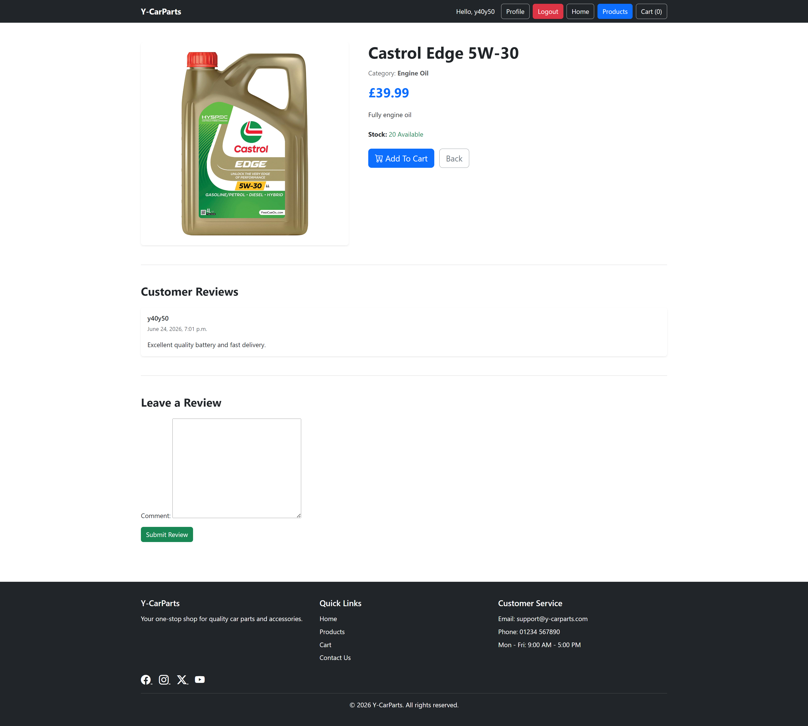

## Shopping Cart


## Checkout


## Stripe Payment


## Login
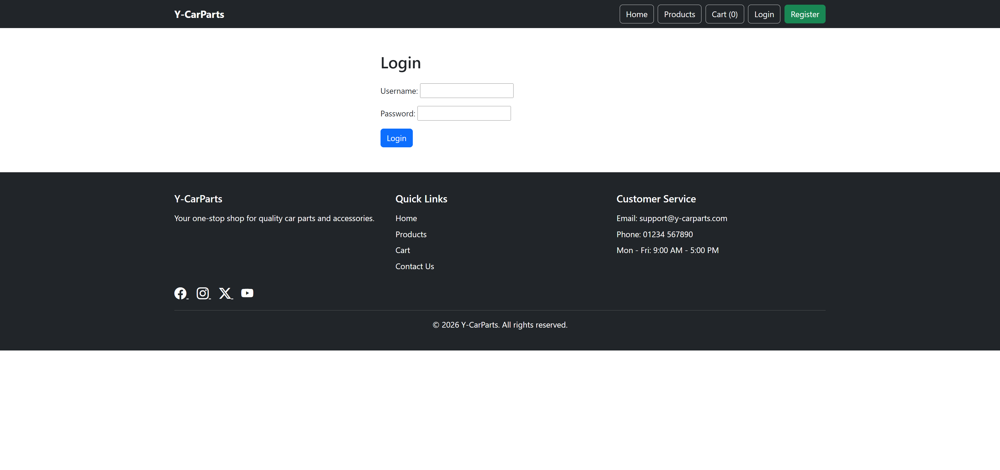

## Register


## Profile Page
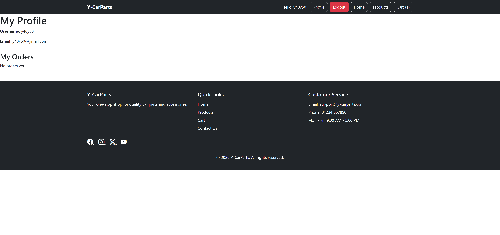

## Django Admin
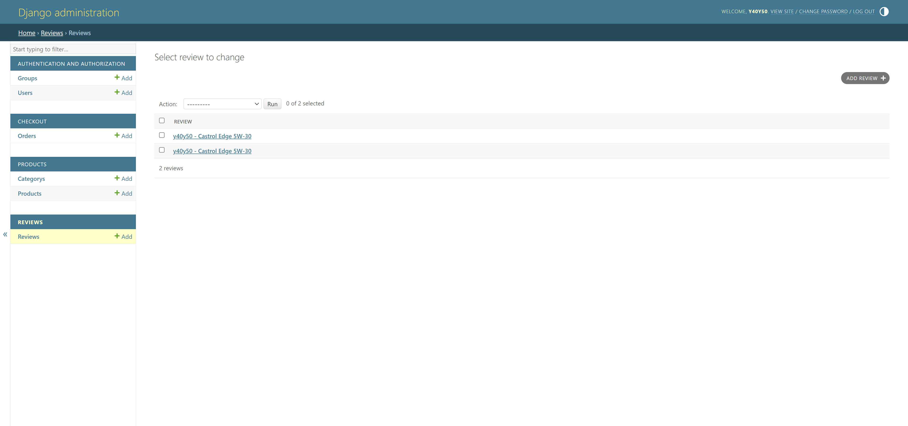

## ERD


---

# Wireframes

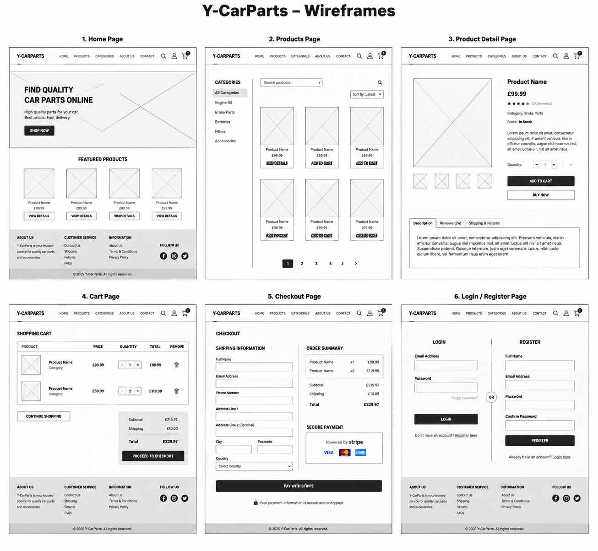

Recommended wireframes:

* Home Page
* Products Page
* Product Details
* Shopping Cart
* Checkout
* Login
* Register

---

# Manual Testing

## Authentication

| Test                                     | Expected Result                   | Actual Result        | Status |
| ---------------------------------------- | --------------------------------- | -------------------- | ------ |
| Register new user                        | User account created successfully | User account created | ✅ Pass |
| Login with valid credentials             | User logged in successfully       | Login successful     | ✅ Pass |
| Logout                                   | User logged out successfully      | User logged out      | ✅ Pass |
| Login with incorrect password            | Error message displayed           | Error displayed      | ✅ Pass |
| Register using an existing username      | Validation error displayed        | Validation displayed | ✅ Pass |
| Leave required registration fields empty | Validation messages displayed     | Validation displayed | ✅ Pass |

---

## Product Catalogue

| Test                        | Expected Result                       | Actual Result              | Status |
| --------------------------- | ------------------------------------- | -------------------------- | ------ |
| View products               | Products displayed correctly          | Products displayed         | ✅ Pass |
| View product details        | Product information displayed         | Product displayed          | ✅ Pass |
| Search existing product     | Matching products returned            | Correct products returned  | ✅ Pass |
| Search non-existing product | "No products found" message displayed | Correct message displayed  | ✅ Pass |
| Filter by category          | Correct products displayed            | Correct products displayed | ✅ Pass |

---

## Shopping Cart

| Test                             | Expected Result                            | Actual Result     | Status |
| -------------------------------- | ------------------------------------------ | ----------------- | ------ |
| Add product to cart              | Product added successfully                 | Product added     | ✅ Pass |
| Increase quantity                | Quantity updated correctly                 | Quantity updated  | ✅ Pass |
| Decrease quantity                | Quantity updated correctly                 | Quantity updated  | ✅ Pass |
| Remove product                   | Product removed successfully               | Product removed   | ✅ Pass |
| Attempt checkout with empty cart | Checkout prevented or empty cart displayed | Correct behaviour | ✅ Pass |


---

## Checkout

| Test                | Expected Result           | Actual Result      | Status |
| ------------------- | ------------------------- | ------------------ | ------ |
| Checkout page loads | Form displayed            | Form displayed     | ✅Pass   |
| Stripe checkout     | Stripe payment page opens | Stripe page opens  | ✅Pass   |
| Test payment        | Payment successful        | Payment successful | ✅Pass   |

---

## Reviews

| Test                | Expected Result           | Actual Result        | Status |
| ------------------- | ------------------------- | -------------------- | ------ |
| Submit review       | Review saved successfully | Review saved         | ✅ Pass |
| Submit empty review | Validation displayed      | Validation displayed | ✅ Pass |


---

## Responsive Testing

| Device  | Expected Result           | Actual Result  | Status |
| ------- | ------------------------- | -------------- | ------ |
| Desktop | Layout displays correctly | Layout correct | ✅ Pass |
| Tablet  | Responsive layout         | Responsive     | ✅ Pass |
| Mobile  | Responsive layout         | Responsive     | ✅ Pass |


---

# Erroneous / Negative Testing

| Test | Expected Result | Actual Result | Status |
|------|-----------------|---------------|--------|
| Login with an incorrect password | User is not logged in and an error message is displayed | Login prevented and error message displayed | ✅ Pass |
| Register using an existing username | Registration is prevented and validation message displayed | Validation message displayed | ✅ Pass |
| Register with empty required fields | Registration is prevented and required field messages displayed | Validation messages displayed | ✅ Pass |
| Submit checkout form with empty required fields | Checkout is prevented and validation messages displayed | Validation messages displayed | ✅ Pass |
| Search for a product that does not exist | No matching products message displayed | Correct message displayed | ✅ Pass |
| Submit an empty review | Review is not submitted and validation message displayed | Validation message displayed | ✅ Pass |
| Attempt to access the register page while logged in | User is redirected to the home page | User redirected successfully | ✅ Pass |
| Attempt to access the Django admin without administrator permissions | Access denied | Access denied | ✅ Pass |
| Enter an invalid product URL | 404 page displayed | 404 page displayed | ✅ Pass |

---

# Bugs

## Fixed Bugs

* Fixed category highlighting when selecting a category.
* Fixed search field displaying "None" when empty.
* Fixed responsive layout for mobile and tablet devices.
* Fixed navigation bar alignment.
* Fixed Stripe API configuration.
* Fixed GitHub push protection by moving secret keys to environment variables.

## Known Bugs

No known bugs at the time of submission.

---

# Future Improvements

Future versions of Y-CarParts could include:

* Wishlist functionality.
* Product comparison.
* Customer order history.
* Email order confirmations.
* Stock notifications.
* Discount and coupon system.
* Product recommendations.
* Multiple product images.
* Product sorting options.
* Online order tracking.

---

# Validation

The project was validated using:

## HTML

* W3C HTML Validator
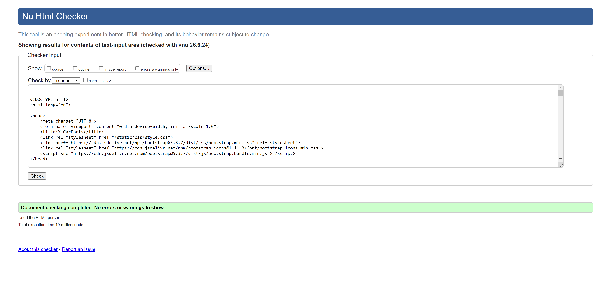


## CSS

* W3C CSS Validator
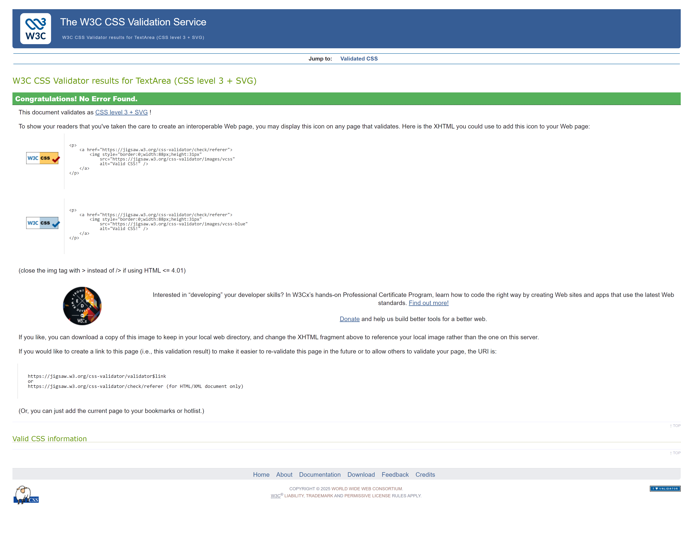

## Python

* CI Python Linter (PEP8)

## JavaScript

* JSHint

## Django

Running:

```bash
python manage.py check
```

returned:

```
System check identified no issues (0 silenced).
```

---

# Lighthouse Testing

Google Lighthouse was used to test the application.

| Category | Score |
|----------|------:|
| Performance | **91** |
| Accessibility | **90** |
| Best Practices | **100** |
| SEO | **90** |


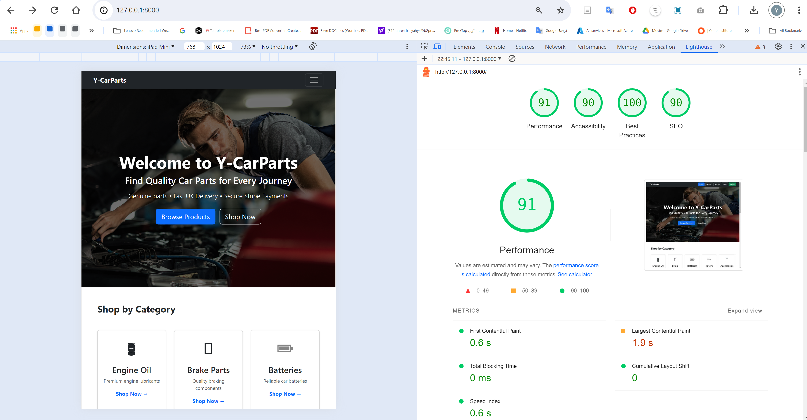

---

# Credits

## Images

Product images were used for educational purposes only.

## Icons

* Bootstrap Icons

## Frameworks

* Django
* Bootstrap 5

## Payment

* Stripe Test Mode

## Acknowledgements

Special thanks to the Code Institute learning materials and Django documentation for guidance throughout the development of this project.


